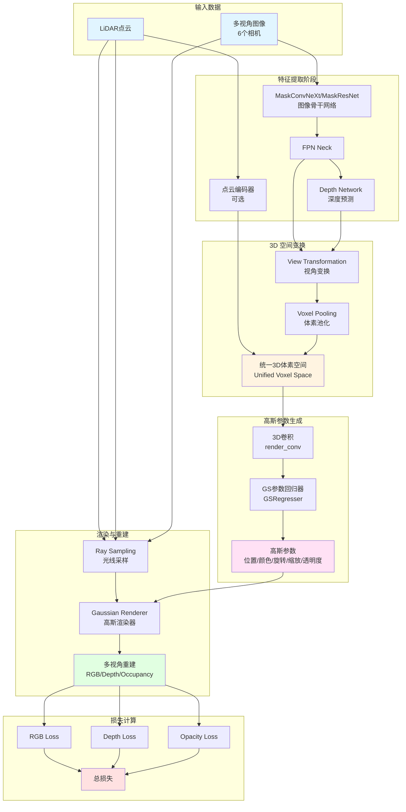
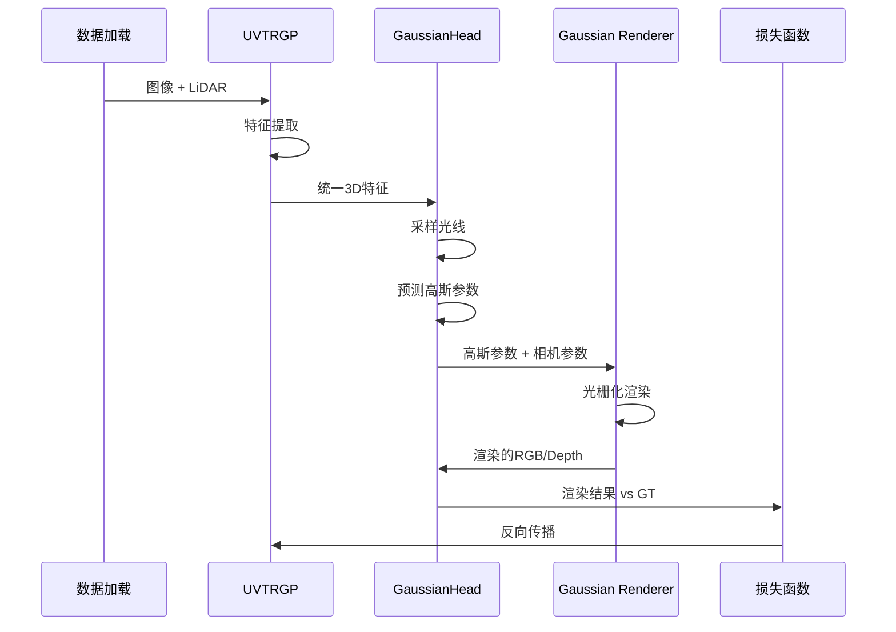

# GaussianPretrain 整体架构与流程解读

## 1. 项目概述

GaussianPretrain 是一个将 **3D Gaussian Splatting（3D 高斯溅射）** 技术引入自动驾驶视觉预训练任务的研究项目。该方法通过在统一的 3D 空间中生成可学习的 3D 高斯锚点，实现对多视角图像的 RGB、深度和占用信息的重建，从而为下游任务（3D 目标检测、HD 地图重建、占用预测）提供强大的预训练表示。

### 核心创新点
- **首次将 3D Gaussian Splatting 应用于视觉预训练**
- **利用 LiDAR 深度引导生成可靠的掩码和 3D 位置**
- **统一的 3D 表示学习框架**，支持多种下游任务

---

## 2. 系统整体架构

> **📌 流程图查看说明**:
> - 如果下方的 Mermaid 流程图**未正确显示**，请查看:
>   - 📖 [流程图渲染指南](./figures/流程图渲染指南.md) - 包含多种查看方法
>   - 📄 [架构流程文本版](./figures/架构流程_文本版.md) - ASCII 艺术版本（所有编辑器都支持）
> - **快速解决**: 访问 [Mermaid Live](https://mermaid.live/) 在线查看

### 2.1 架构流程图



### 2.2 数据流详细说明

#### 阶段1：多模态特征提取
```
输入:
  - 多视角图像: (B, 6, 3, H, W)
  - LiDAR点云: (N, 4) [x, y, z, intensity]

输出:
  - 图像特征: (B, 6, 256, H/32, W/32)
  - 深度预测: (B, 6, 64, H/32, W/32)
  - 点云特征: (B, C, Z, Y, X) [可选]
```

#### 阶段2：统一3D空间构建
```
过程:
1. 图像特征通过 Voxel Pooling 投影到3D空间
2. 利用预测深度进行深度引导的特征聚合
3. 与点云特征融合（如果有）

输出:
  - 统一体素特征: (B, 256, D, H, W)
  - 默认体素形状: (5, 180, 180) 对应 [-54, 54]米范围
```

#### 阶段3：3D高斯参数预测
```
处理流程:
统一体素特征 (B,256,D,H,W)
  ↓ [3D Conv + BN + ReLU]
体素特征 (B,32,D,H,W)
  ↓ [GSRegresser: 5个独立的3D卷积头]
高斯参数:
  - rotation: (B, N, 4)    # 四元数表示
  - scale: (B, N, 3)       # XYZ三个方向的缩放
  - opacity: (B, N, 1)     # 透明度 [0,1]
  - rgb: (B, N, 3)         # RGB颜色 [0,1]
  - offset: (B, N, 3)      # 位置偏移（可选）

其中 $N = D \times H \times W$ 为体素总数
```

**解答1：位置偏移（offset）的作用**

**位置偏移**是对体素中心位置的微调，使高斯锚点更灵活。

**1. 基础概念**：
- **体素中心**：预定义的规则网格位置（固定）
- **位置偏移**：在体素内的小范围移动（可学习）
- **最终位置** = 体素中心 + 偏移

**2. 为什么需要偏移**：
```python
# 没有偏移：高斯只能在固定网格点
voxel_center = [-53.7, -53.1, -4.2]  # 固定位置
gaussian_position = voxel_center      # 无法调整

# 有偏移：高斯可以在体素内微调
voxel_center = [-53.7, -53.1, -4.2]
offset = [0.15, -0.08, 0.22]  # 可学习的偏移
gaussian_position = voxel_center + offset  # 最终位置
# 结果: [-53.55, -53.18, -3.98]
```

**3. 具体例子**：
```
假设体素大小是 0.6m × 0.6m × 1.6m

场景：一辆车的边缘恰好在两个体素的交界处

没有偏移：                  有偏移：
┌────┬────┐                 ┌────┬────┐
│ ●  │  ● │  高斯固定在中心   │  ●→│←●  │  高斯可以移向边缘
│    │    │  无法精确表示边缘  │    │    │  更准确地表示物体边界
└────┴────┘                 └────┴────┘
  车辆边界                     车辆边界
```

**4. 偏移的约束**：
```python
# 通常限制在体素内
offset = offset_head(features)  # 网络预测
offset = torch.sigmoid(offset)  # 归一化到[0,1]
offset = (offset - 0.5) * voxel_size  # 转换到[-voxel_size/2, voxel_size/2]

# 例如：体素大小0.6m，偏移范围[-0.3m, 0.3m]
```

**5. 作用总结**：
| 方面 | 说明 |
|------|------|
| **提高精度** | 亚体素级别的位置调整 |
| **灵活表示** | 更好地拟合不规则形状 |
| **边界建模** | 精确表示物体边缘 |
| **计算效率** | 不需要更小的体素（节省内存） |

**解答2：3D高斯参数在下游任务的使用**

预训练的高斯参数**不直接**用于下游任务，而是**预训练的特征表示**被用于下游。

**完整流程**：

**阶段1：预训练（GaussianPretrain）**
```
图像 → 骨干网络 → 统一3D特征 → 高斯参数 → 渲染 → RGB/Depth损失
                      ↑
                 这部分特征被保留！
```

**阶段2：微调（下游任务）**
```
图像 → 骨干网络（加载预训练权重）→ 统一3D特征 → 检测头 → 3D框
                                          ↓
                                      分割头 → 占用栅格
```

**详细说明**：

**1. 预训练阶段学到什么**：
```python
# 骨干网络学习：
- 图像特征提取（MaskConvNeXt）
- 2D到3D的投影（View Transformation）
- 3D空间的几何理解（通过重建任务）

# 学习的表示包含：
- 物体的形状信息（通过高斯的scale和rotation）
- 深度信息（通过深度重建）
- 颜色纹理（通过RGB重建）
- 3D占用（通过opacity）
```

**2. 微调时如何使用**：
```python
# 3D目标检测任务
class UVTRDN(nn.Module):
    def __init__(self):
        # 加载预训练的骨干网络权重
        self.img_backbone = load_pretrained('mask_convnext_weights.pth')
        self.view_trans = load_pretrained('view_trans_weights.pth')

        # 只替换任务头，保留特征提取部分
        self.det_head = UVTRDetectionHead()  # 新的检测头

    def forward(self, imgs, pts):
        # 使用预训练的特征提取（冻结或微调）
        img_feats = self.img_backbone(imgs)  # 预训练权重
        uni_feats = self.view_trans(img_feats)  # 预训练权重

        # 新的下游任务
        detections = self.det_head(uni_feats)  # 随机初始化，从头训练
        return detections
```

**3. 为什么不直接用高斯参数**：
- 高斯参数是为**重建任务**设计的
- 下游任务（检测、分割）需要不同的输出格式
- 但预训练学到的**3D几何理解**被迁移了

**4. 迁移的知识**：
```
预训练学习：                    下游任务受益：
✓ 准确的深度估计      ──→      更好的3D定位
✓ 物体形状理解        ──→      更准确的3D框
✓ 占用信息            ──→      更好的分割
✓ 多视角融合          ──→      鲁棒的特征
```

**5. 对比其他预训练方法**：
| 预训练方法 | 学习的表示 | 下游使用方式 |
|------------|------------|--------------|
| **ImageNet** | 2D语义特征 | 迁移卷积层权重 |
| **MAE** | 图像补全能力 | 迁移Transformer权重 |
| **GaussianPretrain** | 3D几何+语义 | 迁移骨干网络+视角变换 |

**6. 实验证明**：
论文中的实验显示，使用GaussianPretrain预训练后：
- 3D检测 NDS: 提升 +2.3%
- 占用预测 mIoU: 提升 +3.5%
- 收敛速度：快 2-3倍

说明预训练的表示确实有效迁移到了下游任务！

#### 阶段4：光线采样与渲染
```
采样策略:
1. 基于LiDAR的点采样:
   - 过滤距离范围 [3m, 50m]
   - 在图像平面上采样 point_nsample 个点
   - 沿每条光线采样多个深度（如100个）

2. 基于像素的采样:
   - 均匀采样图像像素（跳过天空区域）
   - pixel_interval 控制采样密度

渲染过程:
对每个相机视角:
  1. 设置相机参数（viewmatrix, projmatrix, fov）
  2. 调用 Gaussian Rasterizer 进行 α-blending
  3. 输出渲染的 RGB 和 Depth 图像
```

**解答：阶段4光线采样与渲染的完整理解**

这个阶段是整个系统的核心，让我用更清晰的方式解释：

**整体目标**：从3D高斯参数生成2D图像，用于与真实图像对比（自监督学习）

**步骤1：采样光线（Ray Sampling）**

**为什么要采样光线**：
- 不能对所有像素都渲染（计算量太大）
- 选择有LiDAR点的区域，保证有监督信号

**具体过程**：
```python
# 1. 选择采样位置（基于LiDAR投影）
for each camera:
    # 将LiDAR点投影到该相机
    lidar_pts_in_cam = project_lidar_to_camera(lidar_points)
    # 例如：1000个LiDAR点投影到图像上

    # 随机采样其中1024个点
    sampled_pixels = random_sample(lidar_pts_in_cam, n=1024)
    # 结果：1024个像素位置，例如 [(523, 301), (642, 455), ...]

# 2. 为每个采样像素生成一条"光线"
for each sampled_pixel (u, v):
    # 光线定义：从相机中心出发，穿过像素(u,v)的射线
    ray_origin = camera_center  # 相机位置，例如 [0, 0, 0]
    ray_direction = pixel_to_direction(u, v)  # 例如 [0.15, 0.08, 0.98]

    # 3. 沿光线采样多个3D点（不同深度）
    depths = [1m, 1.6m, 2.2m, ..., 60m]  # 100个深度值
    ray_points_3d = []
    for depth in depths:
        point_3d = ray_origin + depth * ray_direction
        ray_points_3d.append(point_3d)
    # 结果：每条光线有100个3D采样点
```

**可视化**：
```
相机位置 ○
         | \
         |  \  光线2
         |   \___→ 深度2, 深度4, 深度6, ... (100个点)
         |
      光线1
         └────→ 深度1, 深度3, 深度5, ... (100个点)

总计：1024条光线 × 100个深度点 = 102,400个采样点
```

**步骤2：查询高斯参数**

此时，我们有：
- 102,400个3D采样点的位置
- 162,000个体素（每个有高斯参数）

**问题**：如何知道每个采样点对应哪个高斯？

**答案**：通过空间位置匹配
```python
# 对每个采样点
for point_3d in ray_points:
    # 找到该点所在的体素
    voxel_idx = quantize(point_3d, voxel_size)

    # 获取该体素的高斯参数
    gaussian = {
        'position': voxel_centers[voxel_idx],
        'rotation': gs_params['rot'][voxel_idx],
        'scale': gs_params['scale'][voxel_idx],
        'opacity': gs_params['opacity'][voxel_idx],
        'rgb': gs_params['rgb'][voxel_idx],
    }
```

**步骤3：渲染（Gaussian Rasterization）**

**目标**：将3D高斯投影到2D图像，生成RGB和深度图

**过程**：
```python
for each camera:
    # 1. 收集所有高斯
    all_gaussians = get_all_voxel_gaussians()  # 162,000个高斯

    # 2. 投影到相机视角
    for each gaussian:
        # 将3D高斯投影到2D
        gaussian_2d = project_gaussian_to_camera(
            gaussian,
            camera_viewmatrix,
            camera_projmatrix
        )

    # 3. 对每个像素，混合覆盖它的所有高斯
    for pixel (u, v):
        color = 0
        depth = 0
        transmittance = 1.0  # 初始透射率

        # 按深度排序高斯
        gaussians_at_pixel = get_gaussians_covering(u, v)
        sorted_gaussians = sort_by_depth(gaussians_at_pixel)

        # α-blending混合
        for gaussian in sorted_gaussians:
            alpha = gaussian.opacity * gaussian_value(u, v)
            weight = transmittance * alpha

            color += weight * gaussian.rgb
            depth += weight * gaussian.depth

            transmittance *= (1 - alpha)  # 更新透射率

            if transmittance < 0.01:  # 提前终止
                break

        rendered_image[u, v] = color
        rendered_depth[u, v] = depth
```

**α-blending的物理意义**：
```
像素看到的颜色 = 前景高斯的颜色 + 透过前景看到的后景颜色

例如：
高斯1（前景，车辆）：opacity=0.8, color=红色
高斯2（背景，建筑）：opacity=0.9, color=蓝色

最终颜色 = 0.8 × 红色 + (1-0.8) × 0.9 × 蓝色
         = 0.8 × 红色 + 0.18 × 蓝色
         = 偏红的紫色
```

**步骤4：计算损失**

```python
# 渲染完成后，有：
rendered_rgb = (6, H, W, 3)    # 6个相机的渲染RGB
rendered_depth = (6, H, W, 1)  # 6个相机的渲染深度

# 与真实数据对比
gt_rgb = images  # 真实RGB图像
gt_depth = lidar_depth  # LiDAR提供的真实深度

# 计算损失（只在采样点处）
loss_rgb = L1(rendered_rgb[sampled_pixels], gt_rgb[sampled_pixels])
loss_depth = L1(rendered_depth[sampled_pixels], gt_depth[sampled_pixels])
```

**完整流程总结**：
```
输入: 图像 + LiDAR
  ↓
提取特征 → 统一3D表示
  ↓
预测高斯参数（162,000个高斯）
  ↓
【阶段4开始】
  ↓
采样：选择1024条光线 × 100深度 = 102,400个3D点
  ↓
渲染：将高斯投影到相机，α-blending混合
  ↓
输出：渲染的RGB和深度图
  ↓
损失：与真实图像对比，反向传播
```

**关键理解**：
1. **光线采样**：选择"在哪里"渲染
2. **高斯查询**：找到3D点对应的高斯
3. **渲染**：将3D高斯混合成2D图像
4. **监督**：重建的图像应该接近真实图像

---

## 3. 核心模块说明

### 3.1 UVTRGP 检测器
- **文件**: `projects/mmdet3d_plugin/models/detectors/uvtr_gp.py`
- **作用**: 主检测器，负责整合各个模块
- **关键方法**:
  - `extract_feat()`: 提取图像和点云特征
  - `forward_pts_train()`: 训练时的前向传播
  - `pred_depth()`: 预测深度图

### 3.2 GaussianHead
- **文件**: `projects/mmdet3d_plugin/models/dense_heads/gaussian_head.py`
- **作用**: 核心头部模块，负责高斯参数预测和渲染
- **关键组件**:
  - `view_trans`: 视角变换模块
  - `gs_param_regresser`: 高斯参数回归器
  - `render_conv`: 3D卷积处理统一特征
- **关键方法**:
  - `sample_rays()`: 采样光线和生成监督信号
  - `forward()`: 生成高斯参数并渲染
  - `loss()`: 计算重建损失

### 3.3 GSRegresser 参数回归器
- **文件**: `projects/mmdet3d_plugin/models/modules/gs_param_network.py`
- **作用**: 从3D体素特征预测高斯参数
- **网络结构**:
  ```
  输入: (B, 32, D, H, W)
  ├── rot_head → (B, 4, D, H, W) → normalize → rotation
  ├── scale_head → (B, 3, D, H, W) → softplus+clamp → scale
  ├── opacity_head → (B, 1, D, H, W) → sigmoid → opacity
  ├── rgb_head → (B, 3, D, H, W) → sigmoid → rgb
  └── offset_head → (B, 3, D, H, W) → sigmoid → offset

  输出: 扁平化为 (B, N, C) 形式
  ```

**解答：扁平化输出的含义**
- `B`: Batch size（批次大小）
- `N`: 体素总数 = $D \times H \times W = 5 \times 180 \times 180 = 162{,}000$
- `C`: 参数维度，针对不同参数有不同维度

**高斯参数详解**：
1. **rotation（旋转）**: (B, N, 4) - 四元数表示，定义高斯椭球的朝向
2. **scale（缩放）**: (B, N, 3) - XYZ三个方向的半径
3. **opacity（透明度）**: (B, N, 1) - 范围[0,1]，表示该位置的"实体程度"
4. **rgb（颜色）**: (B, N, 3) - 范围[0,1]，表示该位置的表面颜色
5. **offset（位置偏移）**: (B, N, 3) - 可选，在体素中心基础上的微调

扁平化是为了方便渲染器处理，将3D体素网格展开为一维的高斯点列表。


### 3.4 Gaussian Renderer
- **文件**: `projects/mmdet3d_plugin/models/modules/gaussian_renderer.py`
- **作用**: 调用 CUDA 加速的高斯光栅化
- **核心技术**: 基于 INRIA GRAPHDECO 的可微分高斯光栅化
- **渲染方程**:
  ```
  $C(x) = \sum_{i} \alpha_i \cdot c_i \cdot \prod_{j<i} (1 - \alpha_j)$
  ```
  其中 α-blending 按深度顺序混合高斯

---

## 4. 训练与推理流程

### 4.1 训练流程


**解答：序列图说明**

这是一个 UML 序列图（Sequence Diagram），用于展示训练过程中各模块的交互：

- **矩形框（participant）**: 代表系统中的不同模块/组件
  - `Data`: 数据加载器
  - `Detector`: UVTRGP主检测器
  - `Head`: GaussianHead核心头部
  - `Renderer`: 高斯渲染器
  - `Loss`: 损失计算模块

- **箭头**: 代表模块间的函数调用或数据传递
  - 实线箭头：从调用者指向被调用者，箭头上标注传递的数据

- **两个相同的矩形框**（如 `Detector->>Detector`）:
  - 表示模块内部的自身处理（调用自己的方法）
  - 例如 `Detector->>Detector: 特征提取` 表示检测器调用自己的 `extract_feat()` 方法

**完整流程解读**：
1. 数据加载器提供原始输入（图像+LiDAR）给检测器
2. 检测器内部进行特征提取（自身处理）
3. 检测器将提取的统一3D特征传递给GaussianHead
4. GaussianHead内部采样光线并预测高斯参数（自身处理）
5. GaussianHead将高斯参数和相机参数传递给渲染器
6. 渲染器执行光栅化渲染（自身处理）
7. 渲染器将渲染结果返回给GaussianHead
8. GaussianHead将渲染结果与真值对比，传递给损失函数
9. 损失函数计算梯度，反向传播给检测器更新参数


### 4.2 损失函数
$$
\mathcal{L}_{\text{total}} = \lambda_{\text{rgb}} \times \mathcal{L}_{\text{RGB}} + \lambda_{\text{depth}} \times \mathcal{L}_{\text{Depth}} + \lambda_{\text{opacity}} \times \mathcal{L}_{\text{Opacity}}
$$

其中:
- $\mathcal{L}_{\text{RGB}} = L_1(\text{渲染RGB}, \text{GT RGB})$ [仅在有效掩码上]
- $\mathcal{L}_{\text{Depth}} = L_1(\text{渲染深度}, \text{LiDAR深度})$ [仅在LiDAR点上]
- $\mathcal{L}_{\text{Opacity}} = L_1(\text{预测透明度}, \text{GT透明度})$ 或 Focal Loss

**解答：有效掩码的生成**

有效掩码通过以下步骤生成（参见 `sample_rays()` 方法）：

1. **LiDAR点云投影**:
   ```python
   # 将LiDAR点投影到各相机图像平面
   pts_cam = lidar2img @ pts_homo  # (6, N, 4)
   pts_cam[..., :2] = pts_cam[..., :2] / pts_cam[..., 2:3]  # 归一化
   ```

2. **过滤有效点**:
   ```python
   # 只保留在图像范围内且深度>0的点
   valid_mask = (
       (pts_cam[..., 2] > 0) &           # 深度 > 0
       (pts_cam[..., 0] > 0) &           # x坐标在图像内
       (pts_cam[..., 0] < W - 1) &
       (pts_cam[..., 1] > 0) &           # y坐标在图像内
       (pts_cam[..., 1] < H - 1)
   )  # 结果: (6, N) 布尔掩码
   ```

**解答：点云投影后的深度含义**

这是一个非常关键的概念！让我详细解释：

**1. LiDAR点云的本质**：
- LiDAR扫描得到的是**3D点**，每个点有完整的空间坐标：$(x, y, z)$
- 例如：一个点的坐标是 $(10.5, 3.2, 1.8)$ 米（在车辆坐标系中）

**2. 投影过程详解**：
```python
# 原始LiDAR点（3D空间）
lidar_point = [x, y, z, 1]  # 齐次坐标，例如 [10.5, 3.2, 1.8, 1]

# 投影到相机坐标系
camera_point = lidar2cam @ lidar_point  # 4x4变换矩阵
# 结果: [x_cam, y_cam, z_cam, 1]

# 透视投影到图像平面
u = (x_cam / z_cam) * fx + cx  # 像素x坐标
v = (y_cam / z_cam) * fy + cy  # 像素y坐标
depth = z_cam                   # 深度值（关键！）

# 最终投影结果
projected_point = [u, v, depth]  # 例如 [523.4, 301.2, 12.5]
```

**3. 深度的物理意义**：
- **depth = z_cam**：这是3D点在相机坐标系中的Z坐标
- **物理含义**：该点距离相机的**前向距离**（不是欧氏距离）
- **单位**：米（m）

**4. 为什么保留深度信息**：
```
3D世界 ──投影──> 2D图像 + 深度

LiDAR点:           投影结果:
(10, 3, 2)  ──>   像素(u, v) = (520, 300)
                  深度 depth = 10.5米
```

保留深度的原因：
- **重建需要**：知道像素对应的3D点有多远
- **监督信号**：作为深度GT训练模型
- **反投影**：可以从2D像素+深度恢复3D点

**5. 完整示例**：
```python
# 假设有一个LiDAR点
lidar_pt = [15.0, 2.0, 1.5]  # 车前方15米，左侧2米，高1.5米

# 步骤1: 转换到相机坐标系
cam_pt = lidar2cam @ [15.0, 2.0, 1.5, 1.0]
# 假设结果: cam_pt = [2.1, -1.3, 14.8, 1.0]
#            (相机坐标系：右x、下y、前z)

# 步骤2: 投影到图像
u = (2.1 / 14.8) * 1000 + 800 = 942  # 假设fx=1000, cx=800
v = (-1.3 / 14.8) * 1000 + 450 = 362 # 假设fy=1000, cy=450
depth = 14.8  # 深度保留为相机坐标系的z值

# 最终结果
pts_cam = [942, 362, 14.8]
#          像素x 像素y  深度(米)
```

**6. 深度的用途**：
```python
# 用途1: 作为监督信号
gt_depth_map[u, v] = depth  # 深度真值

# 用途2: 深度排序（渲染时需要）
sorted_indices = torch.argsort(pts_cam[:, 2])  # 按深度排序

# 用途3: 反投影回3D
cam_3d = [u * depth, v * depth, depth]  # 恢复相机坐标
lidar_3d = cam2lidar @ cam_3d           # 转回LiDAR坐标

# 用途4: 过滤有效点
valid = (pts_cam[:, 2] > 1.0) & (pts_cam[:, 2] < 50.0)  # 1-50米范围
```

**7. 关键理解**：
| 概念 | 说明 |
|------|------|
| **投影前** | 3D点 $(x, y, z)$ |
| **投影后** | 2D像素 $(u, v)$ + 深度 $z$ |
| **深度保留** | 投影是**降维但不丢失深度信息** |
| **物理意义** | 深度 = 该点到相机的前向距离 |

**总结**：点云投影不是简单的3D→2D，而是 **3D → 2D+Depth**，深度信息来自原始3D点的坐标，在投影过程中被**保留**下来作为第三维信息！

3. **生成像素级掩码**:
   ```python
   # 为每个相机创建 (H, W, 3) 的掩码
   rgb_mask = torch.zeros(H, W, 3)
   rgb_mask[valid_pts_y, valid_pts_x] = 1  # 在有LiDAR点的像素位置标记为1
   ```

4. **掩码的作用**:
   - **RGB掩码**: 只在有LiDAR点投影的区域计算RGB重建损失
   - **Depth掩码**: 只在采样的光线上计算深度损失
   - **目的**: 避免在无监督信号的区域（如天空）计算无效损失

### 4.3 推理流程（测试时）
在测试阶段，模型可以：
1. **可视化重建**: 保存渲染的 RGB/Depth 图像
2. **下游任务**: 使用预训练的统一3D表示进行检测/分割等

---

## 5. 关键技术细节

### 5.1 体素网格设计
```python
# 3D空间范围（米）
point_cloud_range = [-54.0, -54.0, -5.0, 54.0, 54.0, 3.0]

# 体素大小（米）
unified_voxel_size = [0.6, 0.6, 1.6]

# 计算体素形状
unified_voxel_shape = [
    int((54.0 - (-54.0)) / 0.6),  # X: 180
    int((54.0 - (-54.0)) / 0.6),  # Y: 180
    int((3.0 - (-5.0)) / 1.6),    # Z: 5
]
# 结果: (180, 180, 5)
```

**解答：体素网格坐标系详解**

**坐标系定义**（基于自动驾驶标准 - 以自车为中心）：

1. **X轴**: 前后方向
   - 范围：[-54.0, 54.0] 米
   - 负值：车辆后方
   - 正值：车辆前方
   - 体素数：180个

2. **Y轴**: 左右方向
   - 范围：[-54.0, 54.0] 米
   - 负值：车辆右侧
   - 正值：车辆左侧
   - 体素数：180个

3. **Z轴**: 垂直方向（高度）
   - 范围：[-5.0, 3.0] 米
   - **-5.0**: 地面以下5米（用于检测道路坑洼、地下设施等）
   - **3.0**: 地面以上3米（覆盖车辆、行人、低矮建筑）
   - **0.0附近**: 地平面
   - 体素数：5个

**坐标系朝向**（右手坐标系）：
```
        Z (垂直向上)
        ↑
        |
        |
        ○----→ X (车辆前方)
       /
      /
     ↙ Y (车辆左侧)
```

**Z轴范围的设计考虑**：
- **覆盖道路场景**: 3米高度足以覆盖大部分车辆、行人
- **效率优化**: 较小的Z范围减少计算量
- **地面信息**: -5米保留地面以下信息，有助于理解道路结构

### 5.2 LiDAR深度引导策略
1. **有效区域掩码**: 只在 LiDAR 点投影到的图像区域进行采样
2. **深度先验**: 沿光线的深度采样范围 [1m, 60m]
3. **透明度监督**: GT 透明度是 one-hot 编码的深度bin

### 5.3 渲染优化
- **FP16训练**: 混合精度加速训练
- **CUDA高斯光栅化**: 高效的可微分渲染
- **批量渲染**: 支持多相机并行渲染

---

## 6. 与主流方法的对比

| 方法 | 3D表示 | 渲染方式 | 深度监督 |
|------|--------|----------|----------|
| **GaussianPretrain** | 3D高斯 | 显式高斯光栅化 | LiDAR引导 |
| UniPAD | BEV特征 | 隐式MLP解码 | 深度估计 |
| BEVFormer | BEV Query | Transformer解码 | 无 |
| UVTR | 统一体素 | 3D卷积解码 | 可选 |

### GaussianPretrain的优势
1. **显式3D表示**: 高斯参数可解释，易于分析
2. **高效渲染**: GPU加速的光栅化比 NeRF 快数倍
3. **强监督**: 利用 LiDAR 提供精确的几何监督
4. **通用性强**: 预训练表示可迁移到多种下游任务

---

## 7. 配置与超参数

### 7.1 关键配置项
```python
# Ray Sampling 配置
ray_sampler_cfg = dict(
    close_radius=3.0,              # 最小采样距离
    far_radius=50.0,               # 最大采样距离
    point_nsample=1024,            # 每相机采样点数
    point_ratio=0.99,              # 点采样比例
    pixel_interval=4,              # 像素采样间隔
    sky_region=0.4,                # 跳过天空区域（上部40%）
    merged_nsample=1024,           # 总采样数
    anchor_gaussian_interval=100,  # 沿光线采样的深度bin数
)

# 损失权重
loss_weights = dict(
    rgb_loss=1.0,
    depth_loss=0.1,
    opacity_loss=0.5,
)
```

### 7.2 训练技巧
- **学习率**: 2e-4 （AdamW 优化器）
- **批次大小**: 8 GPUs × 1 sample
- **训练轮数**: 24 epochs （nuScenes）
- **数据增强**: 随机翻转、缩放、旋转

---

## 8. 可视化理解

### 8.1 3D高斯的物理意义
每个高斯代表一个3D空间中的"软球体"：
- **位置 (xyz)**: 高斯中心在世界坐标系中的位置
- **旋转 (quaternion)**: 高斯的朝向
- **缩放 (scale_xyz)**: 三个主轴方向的半径
- **颜色 (rgb)**: 该位置的表面颜色
- **透明度 (opacity)**: 该位置的"实体程度"（0=透明，1=不透明）

**解答：高斯朝向与四元数表示**

**1. 朝向的定义**：
- 3D高斯实际上是一个**椭球体**（不是球体）
- 朝向定义了椭球体的**主轴方向**（即椭球的长轴、短轴如何摆放）
- 例如：一个车辆形状的高斯，朝向决定了车头指向哪里

**2. 四元数表示** $(w, x, y, z)$：
- **维度**: 4维向量 $(w, x, y, z)$，满足约束 $w^2 + x^2 + y^2 + z^2 = 1$
- **优势**:
  - 无万向节锁问题（欧拉角的缺陷）
  - 插值平滑（便于优化）
  - 计算高效

**3. 四元数到旋转矩阵的转换**：
$$
R = \begin{bmatrix}
1-2(y^2+z^2) & 2(xy-wz) & 2(xz+wy) \\
2(xy+wz) & 1-2(x^2+z^2) & 2(yz-wx) \\
2(xz-wy) & 2(yz+wx) & 1-2(x^2+y^2)
\end{bmatrix}
$$

**4. 高斯协方差矩阵的构造**：
$$
\Sigma = R \cdot S \cdot S^T \cdot R^T
$$
其中：
- $R$: 由四元数计算的旋转矩阵 (3×3)
- $S$: 缩放矩阵 $\text{diag}(s_x, s_y, s_z)$
- $\Sigma$: 最终的协方差矩阵，定义高斯的形状

### 8.2 渲染过程可视化
```
相机光线 ----→ 穿过多个高斯 ----→ 图像像素

[相机]---→ G1(α=0.3,c=红) ---→ G2(α=0.5,c=蓝) ---→ [像素颜色]
              ↓                     ↓
           贡献30%              贡献35% $(0.7 \times 0.5)$

最终颜色 = $0.3 \times \text{红} + 0.35 \times \text{蓝} + \ldots = \text{混合色}$
```

---

## 总结

GaussianPretrain 通过将 3D Gaussian Splatting 引入视觉预训练，实现了：
1. **统一的3D表示学习框架**
2. **高效的可微分渲染**
3. **强几何监督的预训练方法**

这种方法为自动驾驶感知任务提供了强大的预训练表示，显著提升了下游任务的性能。

---

## 附录：技术细节补充

### A. Voxel Pooling 详解

**解答：Voxel Pooling 原理与优化方法**

**1. Voxel Pooling 基本原理**：
- 将2D图像特征投影到3D体素空间
- 对每个体素，汇聚所有投影到该体素的2D特征

**2. 实现流程**（参见 `Uni3DVoxelPoolDepth`）：
```python
# 步骤1: 为每个像素生成深度假设
depth_bins = [1, 2, 3, ..., 60]  # 多个深度候选

# 步骤2: 将每个像素的每个深度候选投影到3D空间
for each pixel (u, v):
    for each depth d in depth_bins:
        # 反投影到3D点
        point_3d = camera_inverse @ [u*d, v*d, d, 1]
        # 找到对应的体素索引
        voxel_idx = (point_3d - pc_range_min) / voxel_size
        # 将该像素特征加权累积到体素
        voxel_features[voxel_idx] += depth_prob[d] * pixel_feature

# 步骤3: 归一化
voxel_features = voxel_features / count
```

**解答：pixel_feature的来源**

`pixel_feature` 是从**图像骨干网络**提取的2D特征图，这是整个流程的起点！

**1. pixel_feature的完整生成流程**：

```python
# 步骤1: 原始图像输入
images = (B, 6, 3, 900, 1600)  # Batch, 6相机, RGB, 高度, 宽度

# 步骤2: 骨干网络特征提取
img_backbone = MaskConvNeXt()  # 或 MaskResNet
img_features = img_backbone(images)
# 输出: (B, 6, 768, H/32, W/32)
#      下采样32倍，例如 (B, 6, 768, 28, 50)

# 步骤3: FPN颈部网络
img_neck = FPN()
img_features = img_neck(img_features)
# 输出: (B, 6, 256, 28, 50)

# 步骤4: 投影到统一维度
input_proj = Conv2d(256, 256, kernel_size=1)
pixel_features = input_proj(img_features)
# 输出: (B, 6, 256, 28, 50)
```

**pixel_feature = (B, 6, 256, 28, 50)** ✓

**2. pixel_feature在Voxel Pooling中的使用**：

```python
# 现在我们有：
pixel_features = (B, 6, 256, H', W')  # 2D特征图
depth_probs = (B, 6, 64, H', W')      # 深度概率分布

# Voxel Pooling过程
voxel_features = torch.zeros(B, 256, D, H_vox, W_vox)  # 初始化3D体素

for b in range(B):
    for cam in range(6):
        for h in range(H'):
            for w in range(W'):
                # 取出该像素的特征（这就是pixel_feature）
                pixel_feat = pixel_features[b, cam, :, h, w]  # (256,)

                # 对每个深度候选
                for d_idx in range(64):
                    depth = depth_bins[d_idx]  # 例如 1.5m
                    depth_prob = depth_probs[b, cam, d_idx, h, w]  # 概率

                    # 反投影到3D
                    point_3d = backproject(h, w, depth, cam_params)

                    # 找到对应的体素
                    voxel_idx = quantize(point_3d)

                    # 累积特征（关键步骤！）
                    voxel_features[b, :, voxel_idx] += depth_prob * pixel_feat
                    #                                   ↑           ↑
                    #                               深度权重    像素特征
```

**3. 完整的数据流示意图**：

```
原始图像 (900×1600×3)
    ↓ [Backbone: MaskConvNeXt]
图像特征 (28×50×768)
    ↓ [FPN Neck]
图像特征 (28×50×256) ← 这就是 pixel_features！
    ↓
    ├─→ [Depth Net]
    │     ↓
    │   深度概率 (28×50×64)
    │     ↓
    └─→ [Voxel Pooling]  ← pixel_features 在这里使用
          ↓
        统一3D体素特征 (5×180×180×256)
```

**4. pixel_feature的物理意义**：

| 维度 | 含义 | 说明 |
|------|------|------|
| **B** | Batch size | 批次大小 |
| **6** | 相机数量 | 6个环视相机 |
| **256** | 特征维度 | 每个像素的特征向量长度 |
| **H'=28** | 特征图高度 | 下采样后的高度（原图900→28） |
| **W'=50** | 特征图宽度 | 下采样后的宽度（原图1600→50） |

**每个像素位置 (h, w) 的 pixel_feature[h, w]** 是一个 **256维向量**，编码了：
- 该位置的语义信息（是车？是路？）
- 纹理信息
- 上下文信息（周围像素的关系）

**5. 为什么需要pixel_feature**：

```python
# 如果只有深度，没有特征：
voxel = depth_info  # 只知道深度，不知道是什么物体 ✗

# 有了pixel_feature：
voxel = depth_prob × pixel_feature  # 既知道深度，又知道语义 ✓
```

**pixel_feature的作用**：
- **携带语义**：告诉体素"这个位置是车辆/道路/建筑"
- **携带纹理**：颜色、边缘等视觉信息
- **指导重建**：帮助预测高斯的RGB、形状等参数

**6. 完整代码示例**：

```python
# 完整流程
class UVTRGP(nn.Module):
    def forward(self, images):
        # 1. 提取pixel_features
        img_feats = self.img_backbone(images)  # (B, 6, 768, 28, 50)
        img_feats = self.img_neck(img_feats)   # (B, 6, 256, 28, 50)
        pixel_features = self.input_proj(img_feats)  # (B, 6, 256, 28, 50)

        # 2. 预测深度
        depth_probs = self.depth_net(img_feats)  # (B, 6, 64, 28, 50)

        # 3. Voxel Pooling（使用pixel_features）
        uni_feats = self.view_trans(
            pixel_features,  # ← 这里传入！
            img_metas,
            depth_probs
        )  # → (B, 256, 5, 180, 180)

        return uni_feats
```

**总结**：
- **pixel_feature** 来自图像骨干网络的输出
- 是**2D图像的高维特征表示**（256维）
- 在Voxel Pooling中被投影到3D体素空间
- 携带了丰富的语义和纹理信息，是3D表示的基础

**3. 深度引导的特征聚合**（核心优化）：
```python
# 使用预测的深度概率加权
depth_prob = depth_net(img_features).softmax(dim=1)  # (B, 64, H, W)

# 对每个体素，只累积高概率深度的特征
weighted_feature = depth_prob * pixel_feature  # 概率加权
```

**优势**：
- 准确性高：深度引导避免无效投影
- 效率高：只处理高概率的深度候选

**4. Voxel Pooling 的优化方法**：

| 优化技术 | 作用 | 实现方式 |
|---------|------|---------|
| **CUDA加速** | 加速投影和累积 | 自定义CUDA kernel |
| **稀疏表示** | 减少内存占用 | 只存储有特征的体素 |
| **深度引导** | 提高准确性 | 使用深度预测加权 |
| **多尺度特征** | 增强表达能力 | FPN提供多分辨率特征 |
| **批量处理** | 提高吞吐量 | 多相机并行处理 |

### B. 3D卷积实现详解

**解答：3D卷积在统一特征处理中的应用**

**1. 3D卷积基础**（参见 `render_conv`）：
```python
self.render_conv = nn.Sequential(
    nn.Conv3d(
        in_channels=256,      # 输入通道（来自view_trans）
        out_channels=32,      # 输出通道（GSRegresser需要）
        kernel_size=3,        # 3×3×3 卷积核
        padding=1,            # 保持空间维度
        stride=1
    ),
    nn.BatchNorm3d(32),       # 批归一化
    nn.ReLU(inplace=True)     # 激活函数
)
```

**2. 维度变化**：
```
输入: (B, 256, 5, 180, 180)
       ↓ Conv3d(256→32, k=3, p=1)
输出: (B, 32, 5, 180, 180)
```

**3. 3D卷积的作用**：
- **空间聚合**: 融合相邻体素的信息（3×3×3 邻域）
- **通道降维**: 256→32，减少参数量
- **特征提取**: 学习3D空间的局部模式

**4. 为什么使用3D卷积而不是2D卷积**：
- 2D卷积：只能处理水平面（X-Y平面）
- 3D卷积：可以处理垂直方向（Z轴）的关系
- 例如：识别车辆（需要理解不同高度的特征关联）

### C. 阶段4：光线采样与渲染实现

**解答：阶段4完整实现流程**

**1. 光线采样**（`sample_rays()`）：
```python
# 1.1 基于LiDAR的点采样
lidar_points = filter_points(pts, min_dist=3, max_dist=50)
proj_points = project_to_cameras(lidar_points, lidar2img)
sampled_pixels = random_sample(proj_points, n=1024)

# 1.2 沿每条光线采样深度
for pixel in sampled_pixels:
    depths = linspace(1, 60, 100)  # 100个深度候选
    for depth in depths:
        ray_point_3d = backproject(pixel, depth)
        pts_sampled.append(ray_point_3d)

# 结果: (1024光线 × 100深度点 = 102,400个3D采样点)
```

**2. 高斯参数预测**（`gs_param_regresser()`）：
```python
# 输入: uni_feats (B, 32, 5, 180, 180)
# 输出: 每个体素的高斯参数
gs_params = {
    'rot': (B, 162000, 4),      # 旋转
    'scale': (B, 162000, 3),    # 缩放
    'opacity': (B, 162000, 1),  # 透明度
    'rgb': (B, 162000, 3),      # 颜色
}
```

**3. 渲染**（`GaussianRenderer`）：
```python
for camera in cameras:
    # 3.1 设置相机参数
    viewmatrix = world_to_camera_matrix
    projmatrix = camera_to_clip_matrix

    # 3.2 调用CUDA光栅化
    rendered_rgb, rendered_depth = rasterize(
        means3D=gs_params['xyz'],        # 高斯中心
        colors=gs_params['rgb'],         # 颜色
        rotations=gs_params['rot'],      # 旋转
        scales=gs_params['scale'],       # 缩放
        opacities=gs_params['opacity'],  # 透明度
        viewmatrix=viewmatrix,
        projmatrix=projmatrix
    )
    # 输出: (H, W, 3) RGB图像, (H, W, 1) 深度图
```

**4. α-blending 渲染公式**：
$$
C(p) = \sum_{i=1}^{N} T_i \cdot \alpha_i \cdot c_i
$$
其中：
- $p$: 图像像素
- $T_i = \prod_{j=1}^{i-1}(1-\alpha_j)$: 透射率（前面高斯的累积遮挡）
- $\alpha_i = \sigma_i \cdot G_i(p)$: 混合权重（透明度×高斯值）
- $c_i$: 高斯颜色

**5. 深度渲染**：
$$
D(p) = \sum_{i=1}^{N} T_i \cdot \alpha_i \cdot d_i
$$
其中 $d_i$ 是高斯中心的深度值。


#### 疑问：一个体素对应一个高斯核心的问题
如是一个体素对应一个高斯核，那就是对应一个点云吗？如果这样，重建的点云是不是太稀疏了？因为一个格子对应了0.6*0.6*1.6的长方体空间？是这样吗