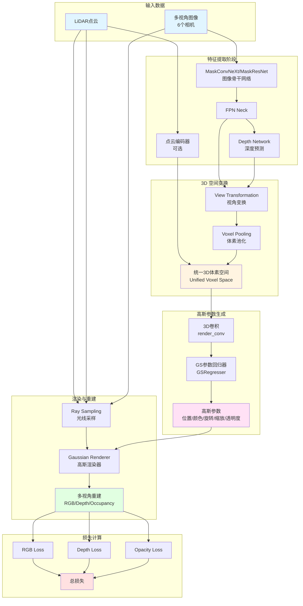
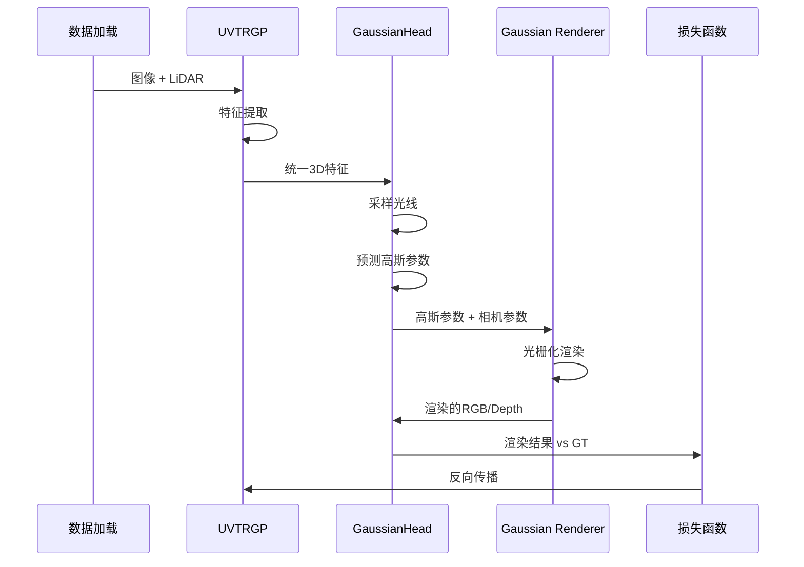

# GaussianPretrain 整体架构与流程解读

## 1. 项目概述

GaussianPretrain 是一个将 **3D Gaussian Splatting（3D 高斯溅射）** 技术引入自动驾驶视觉预训练任务的研究项目。该方法通过在统一的 3D 空间中生成可学习的 3D 高斯锚点，实现对多视角图像的 RGB、深度和占用信息的重建，从而为下游任务（3D 目标检测、HD 地图重建、占用预测）提供强大的预训练表示。

### 核心创新点
- **首次将 3D Gaussian Splatting 应用于视觉预训练**
- **利用 LiDAR 深度引导生成可靠的掩码和 3D 位置**
- **统一的 3D 表示学习框架**，支持多种下游任务

---

## 2. 系统整体架构

> **📌 流程图查看说明**:
> - 如果下方的 Mermaid 流程图**未正确显示**，请查看:
>   - 📖 [流程图渲染指南](./figures/流程图渲染指南.md) - 包含多种查看方法
>   - 📄 [架构流程文本版](./figures/架构流程_文本版.md) - ASCII 艺术版本（所有编辑器都支持）
> - **快速解决**: 访问 [Mermaid Live](https://mermaid.live/) 在线查看

### 2.1 架构流程图



### 2.2 数据流详细说明

#### 阶段1：多模态特征提取
```
输入:
  - 多视角图像: (B, 6, 3, H, W)
  - LiDAR点云: (N, 4) [x, y, z, intensity]

输出:
  - 图像特征: (B, 6, 256, H/32, W/32)
  - 深度预测: (B, 6, 64, H/32, W/32)
  - 点云特征: (B, C, Z, Y, X) [可选]
```

#### 阶段2：统一3D空间构建
```
过程:
1. 图像特征通过 Voxel Pooling 投影到3D空间
2. 利用预测深度进行深度引导的特征聚合
3. 与点云特征融合（如果有）

输出:
  - 统一体素特征: (B, 256, D, H, W)
  - 默认体素形状: (5, 180, 180) 对应 [-54, 54]米范围
```

#### 阶段3：3D高斯参数预测
```
处理流程:
统一体素特征 (B,256,D,H,W)
  ↓ [3D Conv + BN + ReLU]
体素特征 (B,32,D,H,W)
  ↓ [GSRegresser: 5个独立的3D卷积头]
高斯参数:
  - rotation: (B, N, 4)    # 四元数表示
  - scale: (B, N, 3)       # XYZ三个方向的缩放
  - opacity: (B, N, 1)     # 透明度 [0,1]
  - rgb: (B, N, 3)         # RGB颜色 [0,1]
  - offset: (B, N, 3)      # 位置偏移（可选）

其中 N = D×H×W 为体素总数
```

#### 阶段4：光线采样与渲染
```
采样策略:
1. 基于LiDAR的点采样:
   - 过滤距离范围 [3m, 50m]
   - 在图像平面上采样 point_nsample 个点
   - 沿每条光线采样多个深度（如100个）

2. 基于像素的采样:
   - 均匀采样图像像素（跳过天空区域）
   - pixel_interval 控制采样密度

渲染过程:
对每个相机视角:
  1. 设置相机参数（viewmatrix, projmatrix, fov）
  2. 调用 Gaussian Rasterizer 进行 α-blending
  3. 输出渲染的 RGB 和 Depth 图像
```

---

## 3. 核心模块说明

### 3.1 UVTRGP 检测器
- **文件**: `projects/mmdet3d_plugin/models/detectors/uvtr_gp.py`
- **作用**: 主检测器，负责整合各个模块
- **关键方法**:
  - `extract_feat()`: 提取图像和点云特征
  - `forward_pts_train()`: 训练时的前向传播
  - `pred_depth()`: 预测深度图

### 3.2 GaussianHead
- **文件**: `projects/mmdet3d_plugin/models/dense_heads/gaussian_head.py`
- **作用**: 核心头部模块，负责高斯参数预测和渲染
- **关键组件**:
  - `view_trans`: 视角变换模块
  - `gs_param_regresser`: 高斯参数回归器
  - `render_conv`: 3D卷积处理统一特征
- **关键方法**:
  - `sample_rays()`: 采样光线和生成监督信号
  - `forward()`: 生成高斯参数并渲染
  - `loss()`: 计算重建损失

### 3.3 GSRegresser 参数回归器
- **文件**: `projects/mmdet3d_plugin/models/modules/gs_param_network.py`
- **作用**: 从3D体素特征预测高斯参数
- **网络结构**:
  ```
  输入: (B, 32, D, H, W)
  ├── rot_head → (B, 4, D, H, W) → normalize → rotation
  ├── scale_head → (B, 3, D, H, W) → softplus+clamp → scale
  ├── opacity_head → (B, 1, D, H, W) → sigmoid → opacity
  ├── rgb_head → (B, 3, D, H, W) → sigmoid → rgb
  └── offset_head → (B, 3, D, H, W) → sigmoid → offset

  输出: 扁平化为 (B, N, C) 形式
  ```

#### 疑问：输出扁平化为 (B, N, C) 形式表示什么？高斯参数有哪些？


### 3.4 Gaussian Renderer
- **文件**: `projects/mmdet3d_plugin/models/modules/gaussian_renderer.py`
- **作用**: 调用 CUDA 加速的高斯光栅化
- **核心技术**: 基于 INRIA GRAPHDECO 的可微分高斯光栅化
- **渲染方程**:
  ```
  C(x) = Σ_i α_i · c_i · Π_{j<i} (1 - α_j)
  ```
  其中 α-blending 按深度顺序混合高斯

---

## 4. 训练与推理流程

### 4.1 训练流程


#### 疑问：这个流程每个步骤、箭头、方框表示什么意思？为什么每个矩形框有两个一样的？


### 4.2 损失函数
```python
总损失 = λ_rgb × RGB_Loss
        + λ_depth × Depth_Loss
        + λ_opacity × Opacity_Loss

其中:
- RGB_Loss = L1(渲染RGB, GT RGB) [仅在有效掩码上]
- Depth_Loss = L1(渲染深度, LiDAR深度) [仅在LiDAR点上]
- Opacity_Loss = L1(预测透明度, GT透明度) 或 Focal Loss
```

#### 疑问：有效掩码怎么得到的？

### 4.3 推理流程（测试时）
在测试阶段，模型可以：
1. **可视化重建**: 保存渲染的 RGB/Depth 图像
2. **下游任务**: 使用预训练的统一3D表示进行检测/分割等

---

## 5. 关键技术细节

### 5.1 体素网格设计
```python
# 3D空间范围（米）
point_cloud_range = [-54.0, -54.0, -5.0, 54.0, 54.0, 3.0]

# 体素大小（米）
unified_voxel_size = [0.6, 0.6, 1.6]

# 计算体素形状
unified_voxel_shape = [
    int((54.0 - (-54.0)) / 0.6),  # X: 180
    int((54.0 - (-54.0)) / 0.6),  # Y: 180
    int((3.0 - (-5.0)) / 1.6),    # Z: 5
]
# 结果: (180, 180, 5)
```

#### 疑问：体素网格的坐标系是什么，朝向是如何的？-5.0和3.0表示什么？

### 5.2 LiDAR深度引导策略
1. **有效区域掩码**: 只在 LiDAR 点投影到的图像区域进行采样
2. **深度先验**: 沿光线的深度采样范围 [1m, 60m]
3. **透明度监督**: GT 透明度是 one-hot 编码的深度bin

### 5.3 渲染优化
- **FP16训练**: 混合精度加速训练
- **CUDA高斯光栅化**: 高效的可微分渲染
- **批量渲染**: 支持多相机并行渲染

---

## 6. 与主流方法的对比

| 方法 | 3D表示 | 渲染方式 | 深度监督 |
|------|--------|----------|----------|
| **GaussianPretrain** | 3D高斯 | 显式高斯光栅化 | LiDAR引导 |
| UniPAD | BEV特征 | 隐式MLP解码 | 深度估计 |
| BEVFormer | BEV Query | Transformer解码 | 无 |
| UVTR | 统一体素 | 3D卷积解码 | 可选 |

### GaussianPretrain的优势
1. **显式3D表示**: 高斯参数可解释，易于分析
2. **高效渲染**: GPU加速的光栅化比 NeRF 快数倍
3. **强监督**: 利用 LiDAR 提供精确的几何监督
4. **通用性强**: 预训练表示可迁移到多种下游任务

---

## 7. 配置与超参数

### 7.1 关键配置项
```python
# Ray Sampling 配置
ray_sampler_cfg = dict(
    close_radius=3.0,              # 最小采样距离
    far_radius=50.0,               # 最大采样距离
    point_nsample=1024,            # 每相机采样点数
    point_ratio=0.99,              # 点采样比例
    pixel_interval=4,              # 像素采样间隔
    sky_region=0.4,                # 跳过天空区域（上部40%）
    merged_nsample=1024,           # 总采样数
    anchor_gaussian_interval=100,  # 沿光线采样的深度bin数
)

# 损失权重
loss_weights = dict(
    rgb_loss=1.0,
    depth_loss=0.1,
    opacity_loss=0.5,
)
```

### 7.2 训练技巧
- **学习率**: 2e-4 （AdamW 优化器）
- **批次大小**: 8 GPUs × 1 sample
- **训练轮数**: 24 epochs （nuScenes）
- **数据增强**: 随机翻转、缩放、旋转

---

## 8. 可视化理解

### 8.1 3D高斯的物理意义
每个高斯代表一个3D空间中的"软球体"：
- **位置 (xyz)**: 高斯中心在世界坐标系中的位置
- **旋转 (quaternion)**: 高斯的朝向
- **缩放 (scale_xyz)**: 三个主轴方向的半径
- **颜色 (rgb)**: 该位置的表面颜色
- **透明度 (opacity)**: 该位置的"实体程度"（0=透明，1=不透明）

#### 疑问：朝向怎么定义的？用四元数表示吗？

### 8.2 渲染过程可视化
```
相机光线 ----→ 穿过多个高斯 ----→ 图像像素

[相机]---→ G1(α=0.3,c=红) ---→ G2(α=0.5,c=蓝) ---→ [像素颜色]
              ↓                     ↓
           贡献30%              贡献35% (0.7×0.5)

最终颜色 = 0.3×红 + 0.35×蓝 + ... = 混合色
```

---

## 总结

GaussianPretrain 通过将 3D Gaussian Splatting 引入视觉预训练，实现了：
1. **统一的3D表示学习框架**
2. **高效的可微分渲染**
3. **强几何监督的预训练方法**

这种方法为自动驾驶感知任务提供了强大的预训练表示，显著提升了下游任务的性能。


## 疑问
### 阶段2
##### 疑问 Voxel Pooling?有哪些优化方法？
##### 疑问 利用预测深度进行深度引导的特征聚合如何实现的？

### 阶段3
##### 疑问 3D卷积如何实现的?

### 阶段4
阶段4具体如何实现的