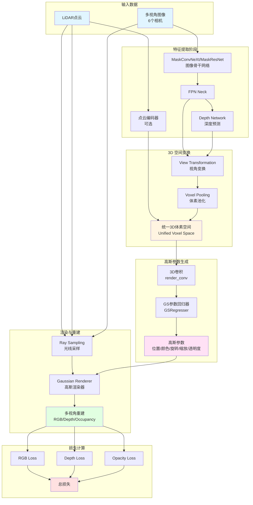

# 流程图可视化解决方案

## 问题说明
Mermaid 流程图在某些 Markdown 阅读器中无法正确显示。

## 解决方案

### 方案1: 使用在线 Mermaid 编辑器（推荐）

**步骤：**
1. 访问 [Mermaid Live Editor](https://mermaid.live/)
2. 将以下代码粘贴到左侧编辑器：



3. 右侧会实时显示流程图
4. 点击右上角的 "Actions" → "PNG" 或 "SVG" 下载图片
5. 将下载的图片保存到 `docs/代码解读/figures/` 目录

### 方案2: 配置 VS Code 支持 Mermaid

**安装插件：**
1. 打开 VS Code
2. 按 `Ctrl+Shift+X` (Windows/Linux) 或 `Cmd+Shift+X` (Mac)
3. 搜索并安装以下插件之一：
   - **Markdown Preview Mermaid Support** (推荐)
   - **Mermaid Editor**
   - **Markdown Preview Enhanced**

**使用方法：**
1. 安装插件后，打开 `.md` 文件
2. 按 `Ctrl+K V` (Windows/Linux) 或 `Cmd+K V` (Mac) 打开预览
3. 流程图会自动渲染

### 方案3: 使用 GitHub/GitLab 在线查看

**步骤：**
1. 将文档推送到 GitHub 或 GitLab
2. 在网页端查看 Markdown 文件
3. GitHub 和 GitLab 原生支持 Mermaid 渲染

### 方案4: 使用 Typora（商业软件）

Typora 原生支持 Mermaid，无需配置：
1. 下载并安装 [Typora](https://typora.io/)
2. 打开文档即可看到渲染的流程图

### 方案5: 使用 mdBook（生成静态网站）

```bash
# 安装 mdBook
cargo install mdbook mdbook-mermaid

# 创建配置
cd docs/代码解读
mdbook init

# 添加 Mermaid 支持到 book.toml
echo '[preprocessor.mermaid]' >> book.toml

# 构建并预览
mdbook serve
```

### 方案6: 命令行生成图片（需要 Node.js）

```bash
# 安装 Mermaid CLI
npm install -g @mermaid-js/mermaid-cli

# 创建 Mermaid 文件
cat > architecture.mmd << 'EOF'
graph TB
    A[输入] --> B[处理]
    B --> C[输出]
EOF

# 生成图片
mmdc -i architecture.mmd -o architecture.png

# 或生成 SVG
mmdc -i architecture.mmd -o architecture.svg
```

## 当前最佳实践

**临时解决方案（立即可用）：**
1. 使用在线编辑器 https://mermaid.live/ 查看和导出图片

**长期解决方案（推荐）：**
1. 安装 VS Code 的 "Markdown Preview Mermaid Support" 插件
2. 或者将仓库托管到 GitHub，利用其原生 Mermaid 支持

## 验证方法

安装插件后，打开文档应该看到类似这样的流程图：
- 蓝色框：输入数据
- 黄色框：统一3D体素空间
- 粉色框：高斯参数
- 绿色框：重建结果
- 红色框：总损失

如果仍有问题，请查看下面的 ASCII 艺术版本或文本描述版本。
